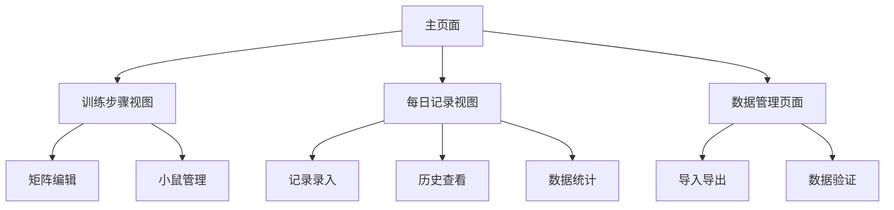

# 小鼠训练记录系统功能扩展需求文档

## 1. 产品概述

本项目是一个小鼠训练步骤记录系统，目前主要用于跟踪每只小鼠所处的训练阶段。现需要扩展功能，添加详细的每日记录模块，用于记录每只小鼠的日常训练详情和生理指标。

该扩展将为研究人员提供更全面的数据记录和分析能力，帮助更好地监控小鼠的训练进度和健康状况。

## 2. 核心功能

### 2.1 用户角色

| 角色 | 注册方式 | 核心权限 |
|------|----------|----------|
| 研究人员 | 密码验证（shogolab） | 可查看、编辑、导入导出所有数据 |

### 2.2 功能模块

我们的小鼠训练记录系统包含以下主要页面：

1. **训练步骤视图**：矩阵显示、小鼠列表管理、步骤编辑功能
2. **每日记录视图**：日常数据录入、历史记录查看、数据统计分析
3. **数据管理页面**：导入导出功能、备份恢复、数据验证

### 2.3 页面详情

| 页面名称 | 模块名称 | 功能描述 |
|----------|----------|----------|
| 训练步骤视图 | 矩阵显示区域 | 显示小鼠与训练步骤的对应关系，支持拖拽分配 |
| 训练步骤视图 | 小鼠列表管理 | 添加、编辑、删除小鼠信息，设置颜色标识 |
| 训练步骤视图 | 步骤编辑功能 | 创建、修改、删除训练步骤，支持拖拽排序 |
| 每日记录视图 | 记录录入表单 | 输入日期、训练时长、体重、奖励水量、任务信息、备注 |
| 每日记录视图 | 历史记录列表 | 按小鼠和日期查看历史记录，支持筛选和排序 |
| 每日记录视图 | 数据统计图表 | 显示体重变化趋势、训练时长统计等可视化图表 |
| 数据管理页面 | 导入导出工具 | JSON格式数据的导入导出，支持备份下载 |
| 数据管理页面 | 数据验证 | 检查数据完整性和一致性，提供修复建议 |

## 3. 核心流程

### 主要用户操作流程：

1. **训练步骤管理流程**：登录系统 → 查看训练矩阵 → 编辑模式 → 添加/移动小鼠 → 保存更改
2. **每日记录流程**：选择小鼠 → 输入日期 → 填写训练数据 → 添加备注 → 保存记录 → 查看历史
3. **数据分析流程**：选择时间范围 → 筛选小鼠 → 查看统计图表 → 导出分析报告

## 4. 用户界面设计

### 4.1 设计风格

- **主色调**：#667eea（蓝紫色）和 #764ba2（深紫色）的渐变
- **辅助色**：#aecbfa（浅蓝）、#d7aefb（浅紫）、#ccff90（浅绿）
- **按钮样式**：圆角矩形，带阴影效果和悬停动画
- **字体**：Segoe UI，标题使用1.5-2rem，正文使用1rem
- **布局风格**：卡片式设计，顶部导航，响应式布局
- **图标风格**：简洁的Unicode符号和emoji

### 4.2 页面设计概览

| 页面名称 | 模块名称 | UI元素 |
|----------|----------|--------|
| 训练步骤视图 | 矩阵显示区域 | 网格布局，粘性表头，拖拽指示器，颜色编码 |
| 每日记录视图 | 记录表单 | 响应式表单，日期选择器，数字输入框，文本区域 |
| 每日记录视图 | 历史记录 | 表格显示，分页控制，筛选器，排序按钮 |
| 每日记录视图 | 统计图表 | Chart.js图表，时间轴，趋势线，数据点标记 |
| 数据管理页面 | 工具栏 | 按钮组，文件上传，进度指示器，状态消息 |

### 4.3 响应式设计

桌面优先设计，移动端自适应。在768px以下屏幕宽度时，矩阵视图切换为卡片布局，表单采用单列布局，图表自动调整尺寸。支持触摸交互优化。