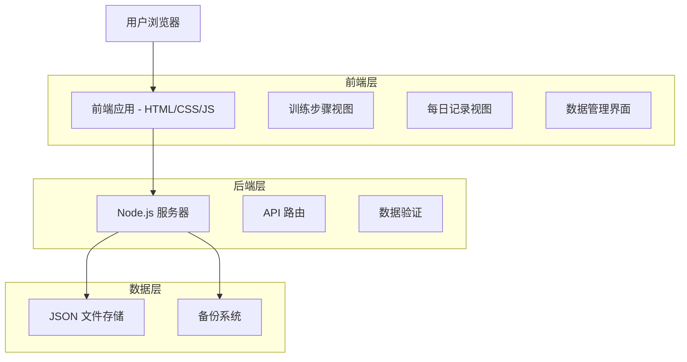
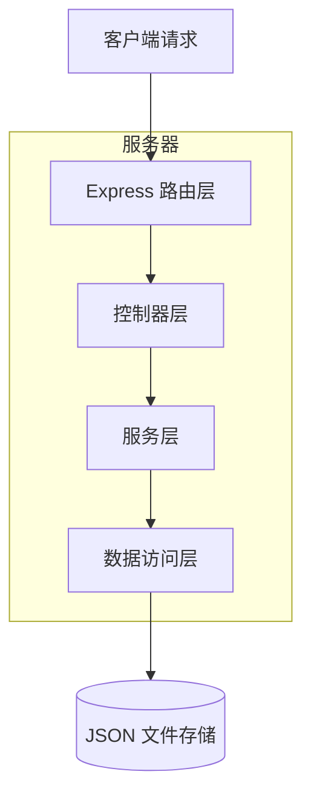
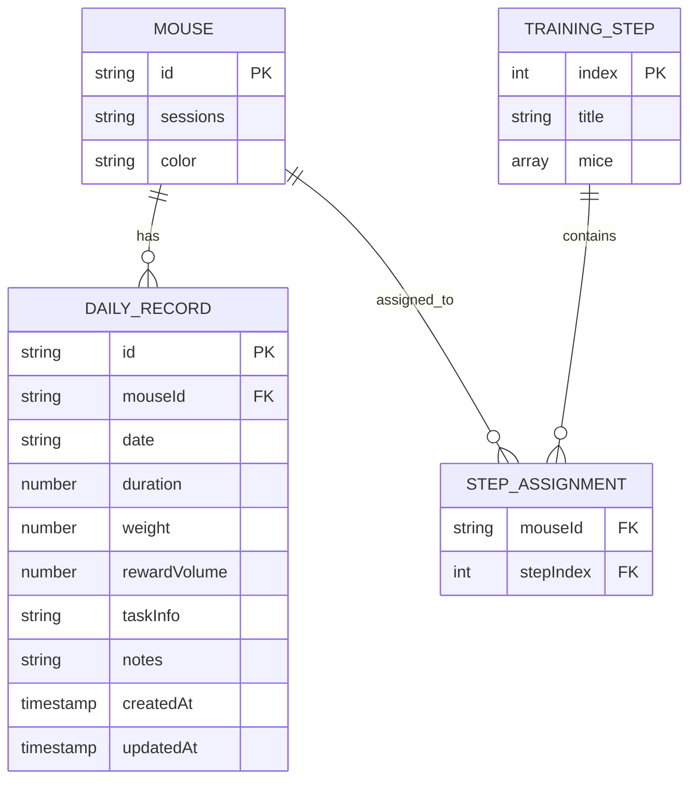

# 小鼠训练记录系统技术架构文档

## 1. 架构设计



## 2. 技术描述

- **前端**: 原生 HTML5 + CSS3 + JavaScript ES6
- **后端**: Node.js + Express.js
- **数据存储**: JSON 文件系统
- **图表库**: Chart.js（用于数据可视化）
- **部署**: PM2 进程管理

## 3. 路由定义

| 路由 | 用途 |
|------|------|
| / | 主页面，显示训练步骤矩阵视图 |
| /daily-records | 每日记录管理页面 |
| /data-management | 数据管理和分析页面 |

## 4. API 定义

### 4.1 核心 API

**训练步骤数据相关**
```
GET /api/data
```
获取所有训练数据

Response:
| 参数名称 | 参数类型 | 描述 |
|----------|----------|------|
| mice | Array | 小鼠列表 |
| steps | Array | 训练步骤列表 |
| mouseOrder | Array | 小鼠显示顺序 |
| dailyRecords | Array | 每日记录数据 |

```
POST /api/data
```
保存训练数据

Request:
| 参数名称 | 参数类型 | 是否必需 | 描述 |
|----------|----------|----------|------|
| mice | Array | true | 小鼠列表 |
| steps | Array | true | 训练步骤列表 |
| mouseOrder | Array | true | 小鼠显示顺序 |
| dailyRecords | Array | false | 每日记录数据 |

**每日记录相关**
```
POST /api/daily-records
```
添加每日记录

Request:
| 参数名称 | 参数类型 | 是否必需 | 描述 |
|----------|----------|----------|------|
| mouseId | string | true | 小鼠ID |
| date | string | true | 记录日期 (YYYY-MM-DD) |
| duration | number | false | 训练时长（分钟） |
| weight | number | false | 体重（克） |
| rewardVolume | number | false | 奖励水量（毫升） |
| taskInfo | string | false | 任务信息 |
| notes | string | false | 备注 |

```
GET /api/daily-records/:mouseId
```
获取指定小鼠的每日记录

```
PUT /api/daily-records/:id
```
更新每日记录

```
DELETE /api/daily-records/:id
```
删除每日记录

**数据备份相关**
```
GET /api/backup
```
下载完整数据备份

## 5. 服务器架构图



## 6. 数据模型

### 6.1 数据模型定义



### 6.2 数据定义语言

**主数据结构 (mouseTrainingData.json)**
```json
{
  "mice": [
    {
      "id": "string",
      "sessions": "string|number",
      "color": "string"
    }
  ],
  "steps": [
    {
      "title": "string",
      "mice": [
        {
          "id": "string",
          "sessions": "string|number",
          "color": "string"
        }
      ]
    }
  ],
  "mouseOrder": ["string"],
  "dailyRecords": [
    {
      "id": "string",
      "mouseId": "string",
      "date": "YYYY-MM-DD",
      "duration": "number",
      "weight": "number",
      "rewardVolume": "number",
      "taskInfo": "string",
      "notes": "string",
      "createdAt": "ISO timestamp",
      "updatedAt": "ISO timestamp"
    }
  ]
}
```

**每日记录索引结构**
```javascript
// 按小鼠ID和日期建立索引以提高查询性能
const dailyRecordsIndex = {
  byMouse: {
    "mouseId": ["recordId1", "recordId2"]
  },
  byDate: {
    "2024-01-01": ["recordId1", "recordId3"]
  }
};
```

**数据验证规则**
```javascript
const validationRules = {
  mouseId: {
    required: true,
    type: 'string',
    minLength: 1
  },
  date: {
    required: true,
    type: 'string',
    pattern: /^\d{4}-\d{2}-\d{2}$/
  },
  duration: {
    type: 'number',
    min: 0,
    max: 1440 // 最大24小时
  },
  weight: {
    type: 'number',
    min: 0,
    max: 1000 // 最大1000克
  },
  rewardVolume: {
    type: 'number',
    min: 0,
    max: 100 // 最大100毫升
  }
};
```